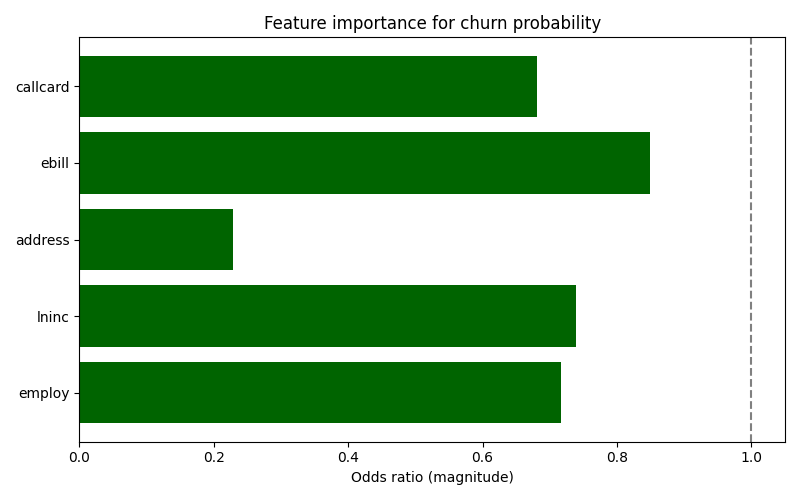
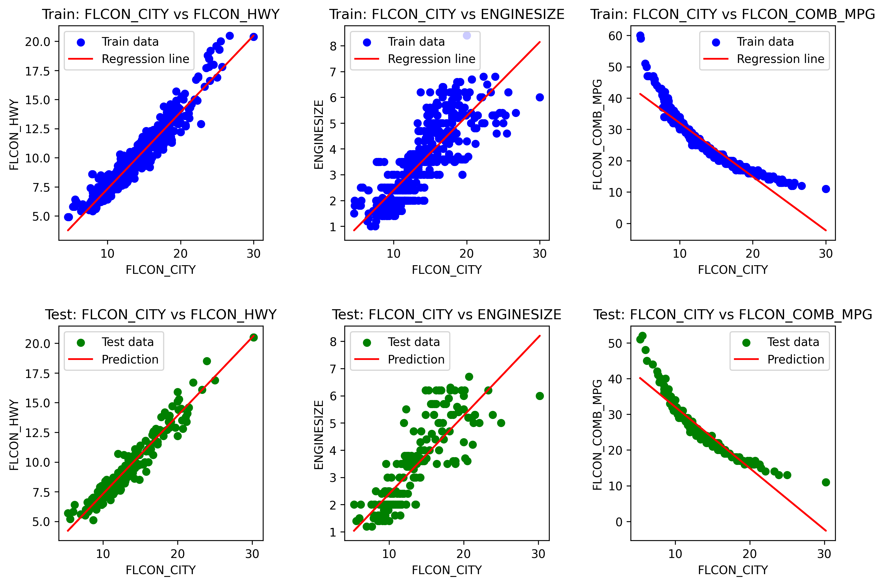
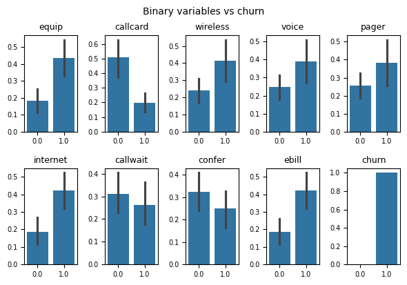
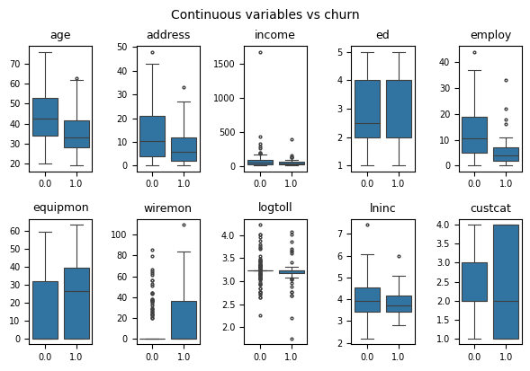

# Machine Learning with Python (IBM)

This repository contains structured LaTeX notes, assignment code, and supporting materials for the [IBM Machine Learning with Python course](https://www.coursera.org/learn/machine-learning-with-python) delivered via Coursera.

## About the Course

This course provides a practical introduction to machine learning using Python, covering foundational algorithms and techniques alongside hands-on implementation. It is designed and delivered by IBM.

### Topics Covered
- Supervised Learning
- Unsupervised Learning
- Model Evaluation & Refinement
- Recommendation Systems
- Support Vector Machines
- Decision Trees & Random Forests
- K-Means & Hierarchical Clustering

## Reproducibility

All datasets used in this project are publicly available and accessible via URL. Each notebook includes the necessary code to download and process the data automatically. As such, cloning this repository and installing the dependencies listed in `requirements.txt` is sufficient to fully reproduce the results and visualisations.

## Example Output

<p align="center">
  
  
  
  
</p>


## Repository Structure

```bash
.
├── latex/                     # LaTeX notes and compiled PDFs for the project
│   ├── notes.tex              # Main LaTeX source file
│   └── notes.pdf              # Compiled version of the notes
│
├── notebooks/                # Jupyter notebooks used for EDA and modelling
│   ├── notebook.ipynb       # Core model development notebook
│   └── ...                    # Additional exploratory or experimental notebooks
│
├── images/                    # Static plots and visual outputs from the analysis
│   ├── image.png              
│   └── ...
│
├── README.md                  # Project overview and documentation
├── .gitignore                 # Files/directories to ignore in version control
└── requirements.txt           # Python dependencies for reproducibility
